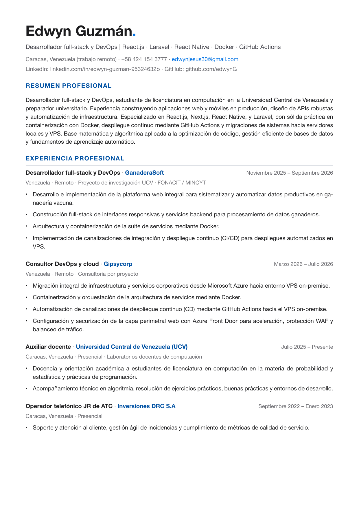
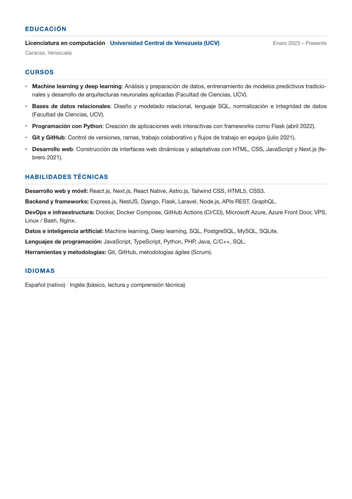

# Plantilla de currículum vitae en LaTeX

Plantilla de currículum vitae profesional, moderna y optimizada para sistemas ATS (applicant tracking systems), desarrollada en LaTeX con una arquitectura modular, limpia y fácil de personalizar.

---

## Vista previa

<p align="center">
  
  &nbsp;
  
</p>

---

## Características principales

- **Tipografía auténtica**: Emplea **Helvetica Neue** directamente desde archivos OpenType (`.otf`) para lograr la estética tipográfica corporativa moderna.
- **Arquitectura 100% modular**: Datos personales, paleta de colores y espaciados verticales se configuran desde variables declaradas al inicio del archivo.
- **Compilación limpia y aislada**: Todos los artefactos de salida (`.pdf`, `.aux`, `.log`, etc.) se generan exclusivamente dentro de la carpeta `build/`, manteniendo la raíz del proyecto limpia.
- **Diseño optimizado para ATS**: Estructura lineal de una sola columna sin tablas invisibles, cajas complejas o elementos flotantes que obstaculicen la lectura automatizada.
- **Generación de vistas previas**: Soporte integrado mediante `make preview` para generar imágenes PNG de alta resolución de cada página.

---

## Requisitos del sistema

Para compilar este documento se requieren las siguientes herramientas:

1. **LuaLaTeX**: Motor tipográfico moderno necesario para interpretar el paquete `fontspec` y cargar tipografías OpenType/TrueType.
2. **GNU Make**: Utilidad para automatizar las órdenes de compilación y limpieza.
3. **Poppler utilities** (`pdftoppm`): Necesario únicamente si se desean exportar las vistas previas en formato PNG.

> [!IMPORTANT]
> **¿Por qué es obligatorio LuaLaTeX?**
> A diferencia de documentos tradicionales de LaTeX que emplean tipografías emuladas mediante Type 1 con `pdflatex`, esta plantilla utiliza `fontspec` para cargar directamente los archivos vectoriales de **Helvetica Neue** (`fonts/HelveticaNeue-*.otf`). `pdflatex` no cuenta con soporte nativo para OpenType y arrojará un error fatal si se intenta compilar con él.

> [!WARNING]
> **Entorno recomendado para Windows**:
> Se recomienda encarecidamente utilizar un entorno **Linux nativo** o **WSL 2** (Windows Subsystem for Linux, ej. con Ubuntu). Herramientas como `make`, `pdftoppm` y el manejo de rutas de LuaLaTeX están diseñadas para entornos Unix y funcionan de forma inmediata bajo WSL. Si estás en Windows, puedes instalar WSL ejecutando `wsl --install` en PowerShell y seguir los pasos de Ubuntu / Debian.

### Instalación de dependencias

#### En distribuciones basadas en Ubuntu / Debian (o Windows con WSL):
```bash
sudo apt update
sudo apt install texlive-latex-base texlive-latex-extra texlive-luatex texlive-lang-spanish poppler-utils make
```

#### En Fedora / RHEL:
```bash
sudo dnf install texlive-scheme-medium texlive-luatex texlive-collection-langspanish poppler-utils make
```

#### En Arch Linux:
```bash
sudo pacman -S texlive-basic texlive-latex texlive-luatex texlive-langspanish poppler make
```

#### En macOS (con Homebrew):
```bash
brew install --cask mactex-no-gui
brew install poppler make
```

---

## Compilación y generación del documento

Existen varias alternativas para compilar el proyecto según tus herramientas de trabajo:

### Método 1: uso de Make (recomendado)

Es la vía más rápida, sencilla y determinista.

- **Compilar el PDF**: Genera el documento final en `build/cv.pdf`:
  ```bash
  make
  ```

- **Compilar y generar vistas previas**: Compila el PDF y genera capturas PNG de cada página en `preview/`:
  ```bash
  make preview
  ```

- **Limpiar el proyecto**: Elimina la carpeta `build/` y cualquier archivo auxiliar:
  ```bash
  make clean
  ```

> [!NOTE]
> El comando `make` ejecuta internamente dos pasadas de `lualatex --output-directory=build` para asegurar que las referencias cruzadas, el contador de páginas y los hipervínculos de Hyperref queden resueltos a la perfección.

### Compilación desde editores de código

Las extensiones de LaTeX en editores como VS Code (por ejemplo, **LaTeX Workshop**) vienen configuradas por defecto para compilar con el comando `latexmk -pdf`. Dado que esta plantilla requiere **LuaLaTeX** para cargar las fuentes tipográficas vectoriales mediante `fontspec`, compilar con `pdflatex` arrojaría un error de incompatibilidad.

El archivo [`.latexmkrc`](.latexmkrc) incluido en el proyecto resuelve esto de forma automática: intercepta cualquier llamada de compilación del editor, fuerza el uso de **LuaLaTeX** y envía todos los archivos generados a la carpeta **`build/`**, permitiéndote presionar el botón de compilar del editor sin configurar nada adicional.

Si en algún entorno tu editor no lee `.latexmkrc` automáticamente, cuentas con las siguientes alternativas:

#### Opción visual (sin editar archivos de configuración)
1. Abre la barra lateral izquierda del editor y haz clic en la pestaña de **LaTeX** (icono de TeX).
2. En la sección **Commands**, despliega **Build LaTeX project**.
3. Haz clic en **Recipe: latexmk (lualatex)** o **Recipe: lualatex**.
4. El editor recordará esta selección y podrás compilar en cualquier momento con el atajo habitual (`Ctrl + Alt + B`).

> [!NOTE]
> Al seleccionar la receta con LuaLaTeX en la barra lateral, el editor ejecutará el motor adecuado sin requerir modificaciones en los archivos del proyecto.

#### Opción mediante configuración del editor (`settings.json`)
Si prefieres que el editor utilice siempre LuaLaTeX y dirija la salida a la carpeta `build/`, añade el siguiente bloque en la configuración de usuario del editor (`Ctrl + Shift + P` $\rightarrow$ `Preferences: Open User Settings (JSON)`):

```json
{
  "latex-workshop.latex.outDir": "%DIR%/build",
  "latex-workshop.latex.recipes": [
    {
      "name": "lualatex",
      "tools": ["lualatex"]
    }
  ],
  "latex-workshop.latex.tools": [
    {
      "name": "lualatex",
      "command": "lualatex",
      "args": [
        "--synctex=1",
        "--interaction=nonstopmode",
        "--file-line-error",
        "--output-directory=%OUTDIR%",
        "%DOC%"
      ]
    }
  ]
}
```

> [!TIP]
> Si no deseas configurar las opciones internas de las extensiones, el método más directo, rápido y universal es abrir la terminal integrada del editor (`Ctrl + \``) y ejecutar simplemente `make` o `make preview`.

---

## Estructura del proyecto

```text
├── Makefile        # Script de automatización de compilación y limpieza
├── .latexmkrc      # Habilita la compilación directa desde el editor hacia build/ con LuaLaTeX
├── .gitignore      # Reglas de exclusión para Git (ignora build/, cv_old/, examples/, etc.)
├── cv.tex          # Archivo fuente principal del currículum
├── fonts/          # Tipografías OpenType auténticas (Helvetica Neue)
│   ├── HelveticaNeue-Regular.otf
│   ├── HelveticaNeue-Bold.otf
│   ├── HelveticaNeue-Medium.otf
│   └── HelveticaNeue-RegularItalic.otf
├── preview/        # Vistas previas en formato PNG para visualización en GitHub
│   ├── page-1.png
│   └── page-2.png
└── README.md       # Documentación general del repositorio
```

---

## Guía de personalización

El diseño completo se encuentra centralizado en los primeros bloques de [cv.tex](cv.tex) para que puedas adaptar el contenido sin necesidad de alterar la lógica interna ni las macros de formato.

### 1. Datos personales y contacto

Modifica tus datos al inicio de la sección `3. DATOS PERSONALES`:

```latex
\newcommand{\cvName}{Tu Nombre Completo}
\newcommand{\cvRole}{Tu especialidad profesional \textbar\ Tecnologías clave}
\newcommand{\cvLocation}{Ciudad, País (modalidad de trabajo)}
\newcommand{\cvPhone}{+58 000 000 0000}
\newcommand{\cvPhoneLink}{+580000000000}           % Número sin espacios para el enlace tel:
\newcommand{\cvEmail}{tu-correo@proveedor.com}
\newcommand{\cvLinkedInUser}{linkedin.com/in/tu-usuario}
\newcommand{\cvLinkedInLink}{https://linkedin.com/in/tu-usuario}
\newcommand{\cvGitHubUser}{github.com/tu-usuario}
\newcommand{\cvGitHubLink}{https://github.com/tu-usuario}
```

### 2. Paleta de colores

Los colores están calibrados con tonos modernos y corporativos en formato hexadecimal. Puedes ajustarlos en la sección `1. CONFIGURACIÓN DE COLORES`:

| Variable | Código hexadecimal | Aplicación en el currículum |
| :--- | :--- | :--- |
| `accent` | `#0051A3` | Títulos de secciones principales y nombres de empresas |
| `dotaccent` | `#0071E3` | Punto distintivo junto al nombre y enlaces interactivos |
| `textdark` | `#1D1D1F` | Grafito oscuro para todo el texto principal de lectura |
| `subtext` | `#46464E` | Gris medio para el subtítulo o cargo profesional |
| `subsecondary` | `#6E6E73` | Gris tenue para fechas, modalidades y separadores |
| `linecolor` | `#DCDFE4` | Filete o línea divisoria sutil debajo de cada sección |

### 3. Espaciados verticales y proporciones

Si añades o eliminas información y deseas rebalancear las distancias para que el contenido encaje de forma balanceada, puedes modificar los valores en `2. CONFIGURACIÓN DE ESPACIOS`:

```latex
\setlength{\SpaceAboveSection}{0.48cm}         % Separación antes del título de cada sección
\setlength{\SpaceSectionTextToLine}{0.28cm}    % Distancia entre el texto de la sección y la línea divisoria
\setlength{\SpaceSectionLineToContent}{0.28cm} % Distancia entre la línea divisoria y el primer elemento
\setlength{\SpaceBetweenJobs}{0.34cm}          % Separación vertical entre bloques de experiencia laboral
\setlength{\SpaceJobTitleToSub}{0.08cm}        % Espacio entre cargo/empresa y modalidad/fechas
\setlength{\SpaceJobSubToItems}{0.20cm}        % Separación antes de la primera viñeta
\setlength{\SpaceBetweenItems}{0.20cm}         % Distancia vertical entre viñetas individuales
```

> [!TIP]
> **Ajuste para mantener 2 páginas exactas**:
> Si al incorporar nuevos empleos o proyectos notas que el texto se desborda hacia una tercera página, reduce ligeramente `\SpaceAboveSection` a `0.42cm` o `\SpaceBetweenJobs` a `0.28cm`. Esto compacta uniformemente el documento sin sacrificar la legibilidad.

### 4. Estructuración del contenido

El documento cuenta con comandos semánticos diseñados para mantener una estructura visual coherente:

#### Secciones generales
```latex
\cvsection{TÍTULO DE LA SECCIÓN}
```

#### Experiencia profesional y educación
Para definir un cargo o titulación se utiliza `\cventry` y viñetas `\cvitem`:
```latex
\cventry{Cargo o rol desempeñado}{Nombre de la empresa}{Ubicación · Modalidad}{Período o fechas}
\cvitem{Descripción del logro, responsabilidad o impacto cuantificable.}
\cvitem{Otra responsabilidad relevante con métricas o tecnologías aplicadas.}

\jobsep % Agrega la separación configurada antes del siguiente bloque
```

> [!NOTE]
> Las viñetas (`\cvitem`) están implementadas con sangría francesa (*hanging indent*). Esto garantiza que el punto indicador (`•`) quede perfectamente centrado con la primera línea de texto y que las líneas subsiguientes se alineen con la primera palabra.

#### Habilidades técnicas
```latex
\cvskill{Categoría temática}{Tecnología 1, Tecnología 2, Herramienta 3, etc.}
```

---

## Control de versiones y publicación en GitHub

El archivo [`.gitignore`](.gitignore) está configurado para que al publicar el proyecto en un repositorio público o privado de GitHub:
- Queden excluidos todos los archivos compilados temporales y carpetas de salida (`build/`).
- Queden excluidos borradores anteriores (`cv_old/`) o currículums de ejemplo (`examples/`).
- El repositorio conserve únicamente los archivos de plantilla limpios, fuentes, vistas previas y documentación.
